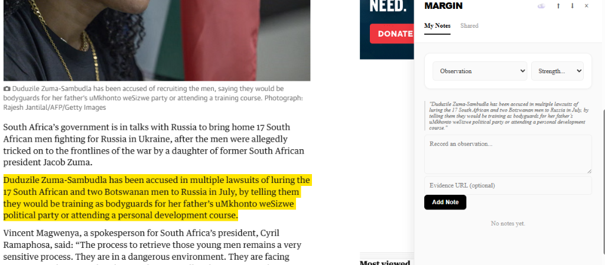
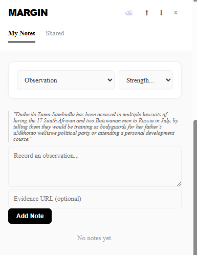
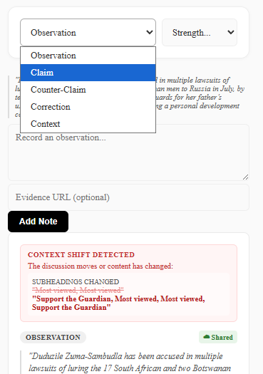
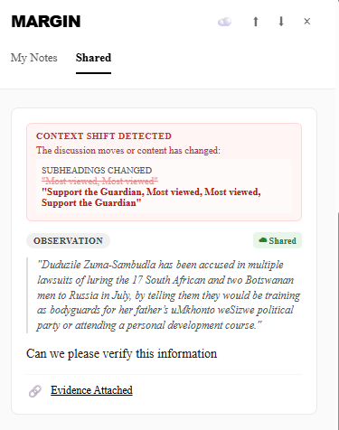

# MARGIN
> **Monitoring Articles for Revision and Governance of Information Networks**

Margin adds a **"truth layer"** to the web. It allows you to attach persistent, evidence-backed notes to any webpage.

## Why Margin?
The web is ephemeral. Articles change, context shifts, and misinformation spreads. MARGIN solves this by allowing you to anchor truth to the page itself.

**Who is this for?**
*   **🕵️ Journalists & Fact-Checkers**: Annotate articles with contradictions or missing context directly on the source.
*   **🎓 Researchers**: Maintain a persistent layer of observations across dynamic web sources.
*   **👥 Communities**: Share a "knowledge layer" over disputed or complex content.

## ⚡ How it works (in 60 seconds)
1.  **Select**: Highlight any text on a webpage.
2.  **Annotate**: Press `Cmd/Ctrl + Shift + .` or right-click to add a note.
3.  **Classify**: Tag it as an **Observation**, **Claim**, **Correction**, or **Context**.
4.  **Proof**: Attach an "Evidence URL" to back up your claim.
5.  **Monitor**: If the page content changes later (drift), Margin warns you that your note's context might be invalid.

## Features
 
### 📝 Contextual Capture
Highlight text on any webpage and attach a note instantly.


### 🗂️ Structured Taxonomy
Classify information as Observation, Claim, Correction, or Context.


### ⚠️ Semantic Drift Detection
MARGIN detects if the underlying article has changed since you left your note. It ignores "noise" (ads/timestamps) but warns you if the headlines or meaning have shifted.


### ☁️ Community Knowledge
Share and view observations from other users on the same URL.


### Other Features
- **Evidence Linking**: Attach evidence URLs to your claims.
- **Local-First**: All data is stored locally in your browser (Chrome Storage).
- **Import/Export**: Backup your notes to JSON.
- **Resilient Anchoring**: Notes stay attached even if minor page edits occur.

## Installation (Developer Mode)

1. Clone or download this repository.
2. Open Chrome and navigate to `chrome://extensions/`.
3. Enable **Developer mode** (top right toggle).
4. Click **Load unpacked**.
5. Select the folder containing this project.

## Development

The project is structured as a standard Chrome Extension (Manifest V3).

- `manifest.json`: Extension configuration.
- `content.js`: Main logic that injects the UI into webpages.
- `background.js`: Service worker for context menus and background tasks.
- `ui/`: Contains the Shadow DOM UI logic and styles.
- `utils/`: Utility modules for storage, hashing, and networking.

### Running Tests

We use [Playwright](https://playwright.dev/) for automated End-to-End (E2E) testing.

1. Install dependencies:
   ```bash
   npm install
   ```

2. Run the test suite:
   ```bash
   npx playwright test
   ```

   **Note:** Tests run in a visible browser window to properly load the extension. Tests verify:
   - UI injection on local test pages.
   - Note creation and persistence.
   - Data import functionality.

## Contributing

1. **Localise**: Ensure your code works with Australian English spelling where applicable in user-facing text (e.g. colour, centre).
2. **Test**: Run the full test suite before submitting changes.
3. **Verify**: Check console logs for any 'Margin:' errors during manual verification.

## License

MIT Licence.
